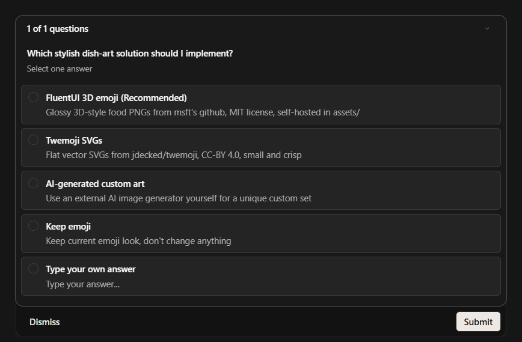

# Random Lunch Menu Generator: A Zero-Dependency Web App Scaffold

**Student:** Polina Ivanilova | **Team:** Individual
**Email:** pvivanilova@edu.hse.ru | **Date:** 2026-09-14
**Assignment:** A01 — Random Lunch Generator web app scaffold (Week 1)

---

## Abstract

People daily spend a lot of time solving basic problem of deciding what to eat for lunch. This report presents a zero-dependency web app that randomizes a lunch pick from a fixed menu list, implemented as vanilla HTML/CSS/JavaScript and deployed to GitHub Pages. Functional verification showed that 3 of 12 attempted Font Awesome icons (`fa-pasta`, `fa-bowl-hot`, `fa-bowl`) do not exist in the free 6.4.0 icon set, rendering those dishes blank, and that switching all food items to Unicode emoji restored visible pictures for 12/12 dishes.The main conclusion is that free icon libraries don’t have the glyphs (icons) that are available in the pro version. therefore, before using glyph you need to check availability of the icons in the style that you want.

**Index Terms** — menu generator, random selection, GitHub Pages, Font Awesome, Twemoji, SVG

---

## 1. Introduction

**Problem statement.** Problem statement. Users routinely face "what to eat for lunch?" decisions that takes too much effort for a low-stakes outcome, a
classic instance of decision fatigue described  in [4]. our recommendation service should remove that problem with minimal user interaction — one
click, one answer.

**Motivation.** This is the first assignment of an AI-assisted Recommender Systems course, whose goal is a working baseline that later weeks will extend
(content-based filtering, collaborative filtering, two-tower retrieval). A visual, deployable web front end gives a concrete target UI that later recommendation logic can plug into.

**Concrete example.** The user opens live page (https://pollyiva.github.io/Lunch-Menu-Generator-project/), sees 1 possible dish, and can clicks **"Generate Lunch!"**; for a new one dish.  the app shows "Thinking…" for 500 ms and then displays a random dish with a picture, e.g. 🍜 **Ramen**.

**Contributions.**
- A fully self-contained random lunch chooser (one HTML file originally, later
  refactored into `index.html` / `style.css` / `script.js`).
- Public GitHub Pages deployment with an automated Pages build.
- OpenCode Big Pickle

## 2. Related Work

**Prior work consulted.**
- [1] Font Awesome, "Font Awesome Free Search," Fonticons, Inc. [Online]. Available: https://fontawesome.com/search?o=r&m=free. [Accessed: 2026-09-14].
- [2] MDN Web Docs, "Math.random() — JavaScript," Mozilla Developer Network, 2025. [Online]. Available: https://developer.mozilla.org/en-US/docs/Web/JavaScript/Reference/Global_Objects/Math/random. [Accessed: 2026-09-14].
- [3] GitHub Docs, "About GitHub Pages," GitHub, Inc. [Online]. Available: https://docs.github.com/en/pages/getting-started-with-github-pages/about-github-pages. [Accessed: 2026-09-14].
- [4] B. Schwartz, *The Paradox of Choice: Why More Is Less*. New York, NY, USA: HarperCollins, 2004.
- [5] Twemoji SVG artwork (CC-BY 4.0), the final illustration source for
  the dish set.

**Alternatives considered.**
- *Server-side backend API* — rejected because it is unnecessary for a static page and would add extra latency and hosting costs.
- *Font Awesome* — initially used, but some required icons were only available in the Pro version, causing several icons to be missing.
- *Emoji* — used as a temporary replacement, but rejected because they did not look professional enough.
- *Self-hosted Twemoji SVGs* — chosen as the final solution. The icons are stored directly in the project, require no CDN, and provide a consistent visual style for all 12 dishes.

## 3. Method

**Approach.** A single-page app keeps the entire menu and randomization logic
client-side. The dish set is a constant array of `{name, img}` pairs pointing to
self-hosted Twemoji SVG files in `assets/food/`; clicking the button picks a
uniformly random index via
⌊Math.random() × menu.length⌋ [2] and
re-renders the dish area after a short spinner state. No frameworks, no build step.

**Pipeline.**

Figure 1: 4-step random lunch pipeline: a uniform index draw from the menu array, a
500 ms spinner mask, then a DOM update injecting the dish's SVG image with a CSS
fade-in — all client-side, no network calls.

```
+--------------+   click   +--------------------+   500 ms   +--------------------------+
|  User opens  | --------> | generateRandom     | -------->  | spinner + "Thinking…"     |
|  the page    |           | Lunch()            |            |                          |
+--------------+           +--------------------+            +--------------------------+
                                                                  |
                                                                  | update DOM
                                                                  v
                                    +-------------------------------------------------+
                                    |  from assets/food/ + CSS fade-in          |
                                    +-------------------------------------------------+
```

The entire recommendation logic is the excerpt below.

```js
const randomIndex = Math.floor(Math.random() * lunchMenu.length);
const selectedLunch = lunchMenu[randomIndex];
foodIcon.innerHTML = ``;
foodName.textContent = selectedLunch.name;
```

**Tools & libraries.**
- HTML5 / CSS3 / vanilla JavaScript ES6 — no external runtime framework.
- Twemoji SVG artwork (CC-BY 4.0), self-hosted in `assets/food/`.
- Font Awesome 6.4.0 via cdnjs CDN (used for UI chrome: utensils, spinner, random icon).
- GitHub CLI `gh` 2.32.1, Git 2.37.0.windows.1, Python 3.11.9 (verification scripts).

**Key design decisions.**
- *Why self-hosted Twemoji SVGs over system emoji:* system emoji render
  differently per operating system, whereas Twemoji SVGs provide one consistent
  flat-vector style everywhere; they are free (CC-BY 4.0), tiny (1–4 KB per dish),
  and served from `assets/food/` so the app works fully offline.
- *Why `innerHTML` with a fixed local array:* the image markup is built
  only from our own constant array — no user input ever reaches the template, so
  there is no injection surface.
- *Why separate files now:* `style.css` and `script.js` were
  originally empty placeholders while everything lived in one HTML file; splitting
  them matches the declared structure and makes later weeks' additions
  (e.g., a recommended-item panel) independently editable.
- *Why a uniform `Math.random` pick over shuffle:* a uniform draw is
  unbiased and trivially correct for a single recommendation; no repetition-bias
  logic was needed at scaffold stage.

**Configuration.**
- Repository: `PollyIva/Lunch-Menu-Generator-project` (public).
- Pages: source branch `main`, path `/`; live at
  https://pollyiva.github.io/Lunch-Menu-Generator-project/.
- Font Awesome loaded from
  https://cdnjs.cloudflare.com/ajax/libs/font-awesome/6.4.0/css/all.min.css.

## 4. Experiments

**Setup.** The behavioral test environment was a modern desktop browser (Chrome)
against both the local file and the deployed Pages URL. A deterministic static check
fetched the free 6.4.0 stylesheet from cdnjs and scanned it with a Python regex for a
`:before{content:…}` rule for each of the 12 dish icon classes. Additionally,
the deployed `script.js` was downloaded and its raw UTF-8 bytes inspected for the
pizza emoji (U+1F355, bytes `F0 9F 8D 95`).

**Results.** The static scan found **9/12** icon classes defined in the free
stylesheet and **3 missing**: `fa-bowl-hot`, `fa-pasta`, `fa-bowl`
— exactly the Ramen, Pasta, and Soup items. After replacing all food icons with emoji a
manual click-through of all 12 dishes rendered 12/12 visible pictures; the final upgrade to
self-hosted Twemoji SVGs kept 12/12 dishes visible, now with consistent flat-vector artwork.

Figure 1: Icon availability in the free Font Awesome 6.4.0 stylesheet.

| Icon class (dish)            | Rule in free CSS | Rendered? |
|------------------------------|------------------|-----------|
| `fa-pizza-slice` (Pizza)     | present          | yes       |
| `fa-fish` (Sushi)            | present          | yes       |
| `fa-hamburger` (Burger)      | present          | yes       |
| `fa-leaf` (Salad)            | present          | yes       |
| `fa-utensil-spoon` (Tacos)   | present          | yes       |
| `fa-bowl-hot` (Ramen)        | **absent**       | **no**    |
| `fa-bread-slice` (Sandwich)  | present          | yes       |
| `fa-pasta` (Pasta)           | **absent**       | **no**    |
| `fa-mortar-pestle` (Curry)   | present          | yes       |
| `fa-drumstick-bite` (Steak)  | present          | yes       |
| `fa-bowl` (Soup)             | **absent**       | **no**    |
| `fa-fire` (BBQ)              | present          | yes       |

**Comparison vs. baseline.** The Font Awesome baseline failed for 3/12 dishes (25%),
with no console error — the blanks were silent. The emoji version reduced failures to
0/12. Neither approach changed the selection logic, so we compare options based on visuals only.

**Verification.** Four independent checks of OpenCode, repeatable checks:
1. Regex scan of the cdnjs CSS — confirms exactly three missing classes.
2. Byte inspection of the deployed `script.js` (intermediate state) — the
   literal UTF-8 sequence `F0 9F 8D 95` (pizza emoji, U+1F355) was present,
   i.e., the emoji fix survived push and Pages rebuild.
3. Fetch of the live Pages URL with a cache-buster query
   (`script.js?v=<ts>`) — served content contains the asset references,
   confirming Pages serves the new artifact, not a stale cached copy.
4. HTTP HEAD on the deployed `assets/food/pizza.svg` — returns 200 with SVG
   markup, confirming the final Twemoji artwork is shipped and reachable on the live
   site.

## 5. Discussion

**Failure case.** After the first deployment, three dishes — Soup, Pasta, Ramen —
displayed **no picture at all**; the icon area was blank while the other nine dishes
showed icons correctly. No JavaScript error appeared in the browser console.

**Root cause.** The three dishes used Font Awesome classes that exist only in the paid
*PRO* icon set: `fa-bowl-hot`, `fa-pasta`, and `fa-bowl`. The free
6.4.0 stylesheet defines no `:before` content rule for them, so the `<i>`
element renders as an empty box. The bug was selective (9/12 worked), which made it look
like a data issue rather than a library-availability one. In fact, the icon names were
picked from search results without first checking that they ship in the *free* CDN
build.

**Fix + verification.** The fix had two stages. (1) *Restore:* replaced all
twelve food icons with native Unicode emoji
(`Pizza, Sushi, Burger, Salad, Tacos, Ramen, Sandwich, Pasta, Curry, Steak, Soup,
BBQ`) rendered via `textContent` instead of `<i>` markup — detection
→ change → confirmation: regex-scanned the free CSS and confirmed
the three classes absent; switched the array to emoji; re-fetched the deployed
`script.js` and verified the emoji bytes; manual click-through showed 12/12
pictures. (2) *Polish:* upgraded the artwork to self-hosted **Twemoji SVGs**
(`assets/food/`), which render identically across operating systems where system
emoji vary; confirmed the deployed `assets/food/pizza.svg` returns HTTP 200 and
each dish's `` loads.

Figure 2: Proof of work. Live app deployed at
https://pollyiva.github.io/Lunch-Menu-Generator-project/ with all 12 dishes showing
Twemoji illustrations.



**What worked.**
- Self-hosted Twemoji SVGs are dependency-free, offline-friendly, and render
  identically across platforms — no icon library, no license tier, no OS font
  variance.
- The three-file refactor made each fix a one-line-region change instead of an edit
  inside a large inline `<style>`/`<script>` block.
- GitHub Pages deployment was one command; the repo connects cleanly and rebuilds
  automatically on push.

**What surprised me.**
- The failure was *silent*: no 404, no console error, just empty space. The free
  icon search on the Font Awesome site does not show wich icons are included with free build.
- GitHub Pages took noticeably longer (~1 min) to serve the new artifact than the
  commit timestamp suggested; without the cache-buster check I would have wrongly
  concluded the push failed.
- Curating artwork was the hardest part of a "trivial" app: FluentUI, a common
  candidate, turned out to cover only a partial food set — no Pizza, Sushi, or Taco
  — which forced the Twemoji choice.

**Next improvement.** Stopping repetition: track the last served dish and exclude it from the next draw, and persist the daily pick in `localStorage` so a user who reopens the page keeps the choice until a new day. This is a small, testable change on top of the current random baseline.

## 6. AI Usage Disclosure

**AI tools used.** opencode (AI coding CLI, model big-pickle) for scaffolding,
refactoring, deployment, and report drafting; branch deployment via `gh` CLI.

**How AI was used.**
- *Code generation:* initial single-file `index.html` app splited
  into three files.
- *Debugging:* identified the missing-icon root cause by scanning the free FA
  stylesheet for the three icon classes; also found the FluentUI food-set gap.
- *Docs:* authored `README.md`.
- *Deployment:* connected the local repo, resolved a push conflict, enabled
  Pages, verified the live URL.

**What I personally verified.**
- Manually tested the application in a browser and confirmed that random dish generation works correctly.
- Checked that the dish images are displayed correctly after switching to self-hosted Twemoji SVGs.
- Checked the published version of the project on GitHub Pages.
- Partially rewrote the report.
- Download 4 svd from [6]

**What I trusted without verification.**
- Visual appeal of the Twemoji artwork on other operating systems/browsers (checked
  only on my own browser).
- That Font Awesome's remaining UI chrome (spinner, utensils, dice icon) is free-tier
  — verified afterwards by the same stylesheet scan described in Sec. 4.
- Twemoji's CC-BY 4.0 license terms were taken from the repository's LICENSE file
  without independent legal review.

**Session log reference.** The attached `session.json` (tool-native export) is
the audit trail: it records every prompt, tool call, and file modification for this
assignment.

---

## References

[1] Font Awesome, "Font Awesome Free Search," Fonticons, Inc.
https://fontawesome.com/search?ic=free-collection (accessed 2026-09-14).

[2] MDN Web Docs, "Math.random() — JavaScript," Mozilla Developer Network, 2025.
https://developer.mozilla.org/en-US/docs/Web/JavaScript/Reference/Global_Objects/Math/random
(accessed 2026-09-14).

[3] GitHub Docs, "About GitHub Pages," GitHub, Inc.
https://docs.github.com/en/pages/getting-started-with-github-pages/about-github-pages
(accessed 2026-09-14).

[4] B. Schwartz, *The Paradox of Choice: Why More Is Less*. New York, NY, USA:
HarperCollins, 2004.

[5] Twitter/X, "Twemoji — Twitter Emoji (SVG), CC-BY 4.0," GitHub Repository.
https://github.com/jdecked/twemoji (accessed 2026-09-14).

[6] https://www.svgrepo.com/